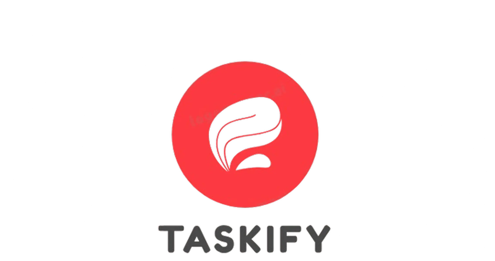

# Taskify Backend



Taskify es una aplicación backend robusta diseñada para la gestión eficiente de proyectos y tareas, facilitando la colaboración y mejorando la productividad del equipo.

## ✨ Características Principales

- **Gestión de Proyectos:** Creación, actualización y seguimiento del estado de los proyectos.
- **Gestión de Tareas:** Asignación, organización y seguimiento del progreso de las tareas dentro de los proyectos (estados: Pendiente, En Progreso, Completada).
- **Colaboración:** Comparte proyectos fácilmente mediante códigos de invitación únicos.
- **Usuarios y Roles:** Gestión de usuarios y asignación de roles.
- **Autenticación y Autorización:** Seguridad basada en JWT.
- **Notificaciones (Opcional):** Recordatorios para tareas próximas a vencer.
- **Visualización:** Posibilidad de integrar con un frontend para visualizar tareas en calendarios o tableros Kanban.

## 🛠️ Pila Tecnológica

- **Lenguaje:** Java 21
- **Framework:** Spring Boot 3
- **Persistencia:** Spring Data JPA
- **Base de Datos:** PostgreSQL
- **Contenerización:** Docker
- **Build Tool:** Maven

## 🚀 Cómo Empezar

Sigue estos pasos para configurar y ejecutar el backend de Taskify en tu entorno local.

### Requisitos Previos

- JDK 21 o superior
- Maven 3.x
- PostgreSQL Server
- Docker (Opcional, para ejecución en contenedor)

### Instalación y Configuración

1.  **Clona el Repositorio:**

    ```bash
    git clone <URL_DEL_REPOSITORIO> # Reemplaza con la URL real de tu repositorio
    cd taskifyApi
    ```

2.  **Configura la Base de Datos:**

    - Asegúrate de tener una instancia de PostgreSQL en ejecución.
    - Crea una base de datos para Taskify (por ejemplo, `taskifydb`).
    - Configura la conexión a la base de datos en el archivo `src/main/resources/application.yml`. Modifica las siguientes propiedades según tu configuración:
      ```yaml
      spring:
        datasource:
          url: jdbc:postgresql://localhost:5432/taskifydb # Ajusta host, puerto y nombre de BD si es necesario
          username: tu_usuario_db # Reemplaza con tu usuario de PostgreSQL
          password: tu_contraseña_db # Reemplaza con tu contraseña de PostgreSQL
          driver-class-name: org.postgresql.Driver
        jpa:
          hibernate:
            ddl-auto: update # O 'validate', 'create', 'create-drop' según tus necesidades
          show-sql: true # Cambia a false en producción
      ```
    - **Nota:** Es recomendable usar variables de entorno para las credenciales en entornos de producción en lugar de codificarlas directamente en `application.yml`.

3.  **Construye el Proyecto:**
    Navega a la raíz del proyecto (`taskifyApi`) y ejecuta:
    ```bash
    ./mvnw clean install
    ```
    O si tienes Maven instalado globalmente:
    ```bash
    mvn clean install
    ```

### Ejecución

1.  **Ejecuta la Aplicación:**
    Puedes ejecutar la aplicación usando el plugin de Spring Boot para Maven:

    ```bash
    ./mvnw spring-boot:run
    ```

    O ejecutando el archivo JAR generado (después de construir):

    ```bash
    java -jar target/taskifyApi-*.jar # Reemplaza * con la versión actual
    ```

    La aplicación estará disponible por defecto en `http://localhost:8080`.

2.  **Ejecución con Docker (Opcional):**
    - Asegúrate de tener Docker instalado y en ejecución.
    - Construye la imagen Docker:
      ```bash
      docker build -t taskify-backend .
      ```
    - Ejecuta el contenedor. Asegúrate de pasar las variables de entorno necesarias para la conexión a la base de datos si no las codificaste en `application.yml`:
      ```bash
      docker run -p 8080:8080 \
        -e SPRING_DATASOURCE_URL=jdbc:postgresql://<host_db>:<port_db>/<nombre_db> \
        -e SPRING_DATASOURCE_USERNAME=<usuario_db> \
        -e SPRING_DATASOURCE_PASSWORD=<contraseña_db> \
        --name taskify-app \
        taskify-backend
      ```
      **Nota:** Reemplaza los placeholders `<...>` con tus valores reales. Considera usar Docker Compose (`docker-compose.yml`) para una gestión más sencilla de la base de datos y la aplicación.


## 📜 Licencia

Este proyecto está bajo la Licencia MIT.
